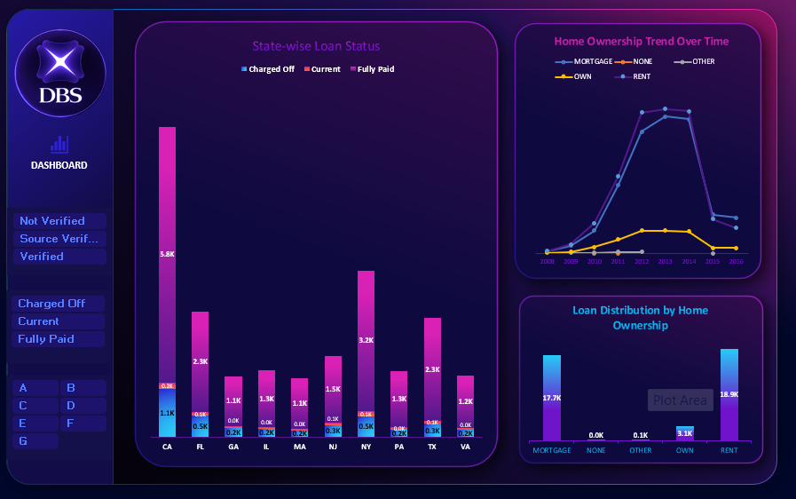

# Bank Loan Customer Analytics Dashboard

An interactive Excel dashboard developed to analyze bank loan performance, customer behavior, repayment activity, loan status, verification status, and year-wise loan trends.

## 📊 Excel Dashboard

The complete Excel workbook is available through Google Drive because the workbook size exceeds GitHub's file-size limit.

👉 **[Download Excel Dashboard (.xlsx)](https://docs.google.com/spreadsheets/d/1heSEdGEfZBPHWxcCDYMku89S9fOWQf1u/edit?usp=drivesdk&ouid=111810264358677548146&rtpof=true&sd=true)**

## 🖼️ Dashboard Preview

## 🎯 Project Objective

The objective of this project is to analyze bank loan data and provide meaningful insights into:

- Loan portfolio performance
- Customer loan behavior
- Loan repayment
- Loan status
- Charged-off loans
- Verification status
- Customer grades
- Revolving balance
- Year-wise loan trends

The dashboard helps users understand important loan performance indicators and identify potential areas of credit-risk monitoring.

## 🛠️ Tools & Technologies

- Microsoft Excel
- Pivot Tables
- Pivot Charts
- Excel Formulas
- Data Cleaning
- Data Analysis
- Data Visualization
- Conditional Formatting
- Interactive Dashboard
- KPI Analysis

## 📊 Key KPIs

The dashboard focuses on important financial and loan-performance KPIs such as:

- Total Loan Amount
- Total Payment Received
- Recovery Rate
- Fully Paid Loans
- Current Loans
- Charged-Off Loans
- Average Revolving Balance

## 📈 Dashboard Analysis

### 1. Loan Status Analysis

Analyzes the distribution of loans across:

- Fully Paid
- Current
- Charged Off

This helps understand the overall repayment status of the loan portfolio.

### 2. Verification Status

Analyzes loans based on:

- Verified
- Source Verified
- Not Verified

This provides an overview of verification patterns within the loan portfolio.

### 3. Average Revolving Balance by Grade

Compares the average revolving balance across customer grades from A to G.

This helps identify differences in customer financial behavior across grades.

### 4. Year-wise Loan Analysis

Analyzes loan amounts across different years to identify:

- Loan growth
- Peak periods
- Changes in lending activity
- Overall portfolio trends

## 🎛️ Dashboard Features

- Interactive Excel dashboard
- KPI cards
- Pivot Tables
- Pivot Charts
- Dynamic filtering
- Year-wise analysis
- Loan status analysis
- Verification analysis
- Customer grade analysis
- Financial performance analysis

## 💡 Key Business Insights

- Fully Paid loans represent a significant portion of the analyzed loan portfolio.
- Charged-Off loans require closer monitoring from a credit-risk perspective.
- Verification status provides an additional dimension for analyzing loan performance.
- Revolving balance varies across customer grades.
- Year-wise analysis helps identify changes in loan issuance and portfolio growth.

## 🔍 Business Questions Answered

This dashboard helps answer:

1. What is the total loan amount?
2. How much payment has been received?
3. What is the recovery rate?
4. How are loans distributed by status?
5. How many loans are charged off?
6. What is the distribution of verification status?
7. How does revolving balance vary by customer grade?
8. How has loan issuance changed over the years?
9. Which years experienced higher loan activity?
10. What patterns can be observed in the overall loan portfolio?

## 🧹 Data Analysis Process

The project followed a structured data-analysis workflow:

1. Data collection
2. Data understanding
3. Data cleaning
4. Data validation
5. Data transformation
6. Exploratory analysis
7. KPI calculation
8. Pivot Table creation
9. Dashboard development
10. Business insight generation

## 📊 Excel Techniques Used

- Pivot Tables
- Pivot Charts
- Data Cleaning
- Data Validation
- Conditional Formatting
- Excel formulas
- KPI calculations
- Data summarization
- Interactive filtering
- Dashboard design

## 🚀 Future Improvements

The dashboard can be further enhanced by adding:

- Default-rate analysis
- Loan purpose analysis
- Interest-rate analysis
- Income-based customer segmentation
- Debt-to-income analysis
- Geographic loan analysis
- Monthly loan trends
- Risk segmentation
- Predictive loan-default analysis

## 👩‍💻 Author

**Gauri Annadate**

B.Tech – Information Technology

**Skills:** SQL | Python | Excel | Power BI | Tableau | Data Analytics
